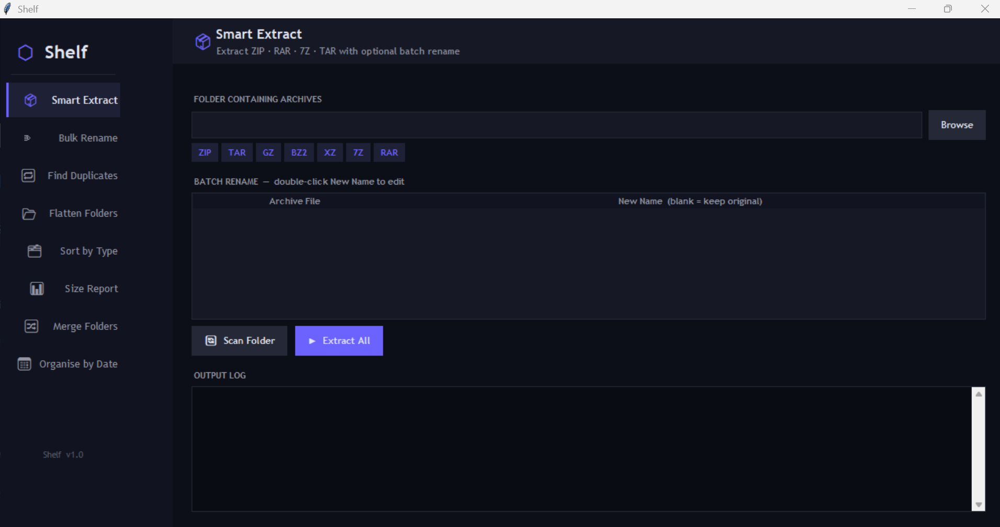

# ⬡ Shelf — File Management Toolkit

A desktop utility suite for Windows (works on macOS/Linux too) that automates
common file and folder operations through a polished dark UI.

---

## 🚀 Tools Included

| Tool | What it does |
|---|---|
| 📦 Smart Extract | Unzips ZIP, RAR, 7Z, TAR, GZ and more. Auto-promotes nested folders. Lets you batch rename at extract time. |
| ✏️ Bulk Rename Folders | Find & replace text in folder names. Supports plain text and regex. |
| 🔁 Find Duplicates | Scans for duplicate files by MD5 hash and removes extras (sends to trash if possible). |
| 📂 Flatten Folders | Moves all files from nested sub-folders up to the root. |
| 🗂️ Sort by File Type | Organises files into Images, Videos, Audio, Documents, Code, Archives, Other. |
| 📊 Folder Size Report | Lists all files & folders sorted by size (B / KB / MB / GB). |
| 🔀 Merge Folders | Copies contents of multiple folders into one destination. |
| 📅 Organise by Date | Moves files into YYYY-MM sub-folders based on modified date. |

---

## 📦 Install

```bash
pip install -r requirements.txt
python filekit.py
```

> Python 3.8+ required. Download from https://python.org

### Optional archive support

| Format | Library |
|---|---|
| `.7z` | `py7zr` (included in requirements) |
| `.rar` | `rarfile` (included in requirements) |
| `.zip .tar .gz` | Built into Python — no install needed |

---

## 🖥️ Screenshot

Dark sidebar navigation, live log output, folder browser — all in one window.

---

## 📁 Project Structure

```
filekit.py          ← Main app (single file, all tools included)
requirements.txt    ← Python dependencies
README.md
```

---

## 📝 License

MIT — free to use, modify, and distribute.


